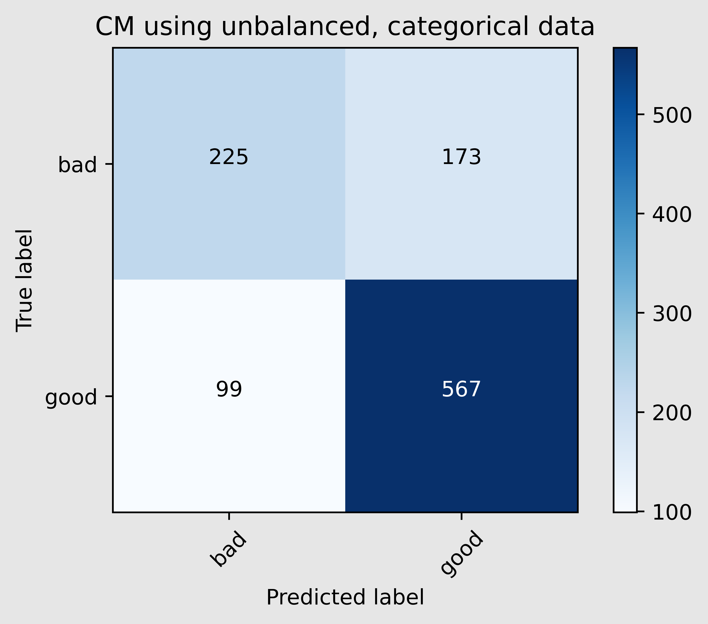
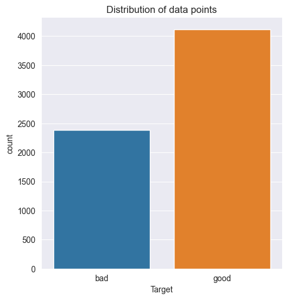
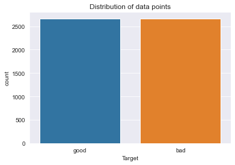
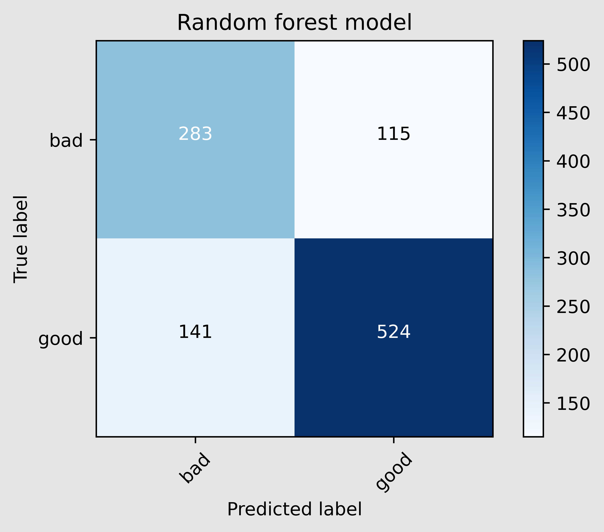
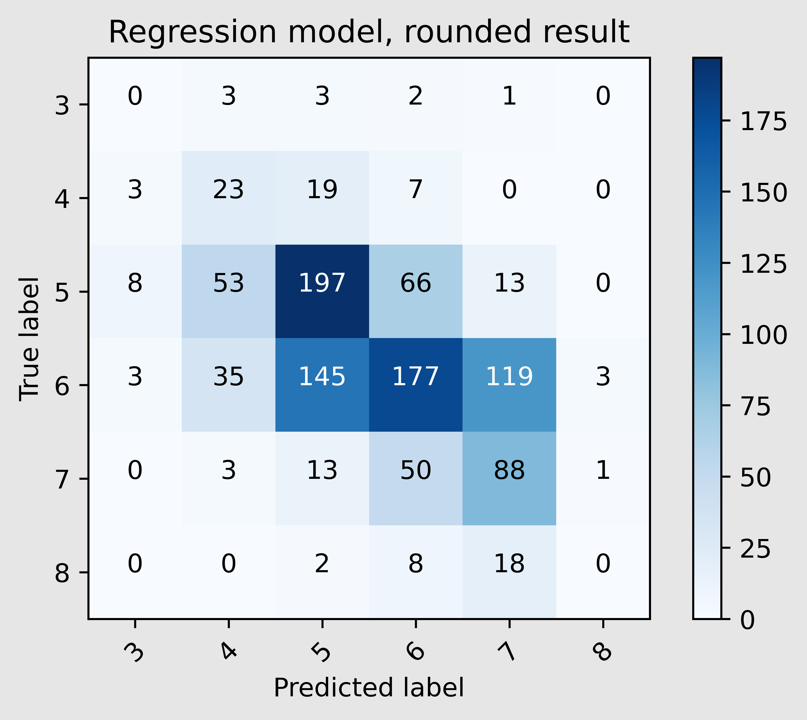
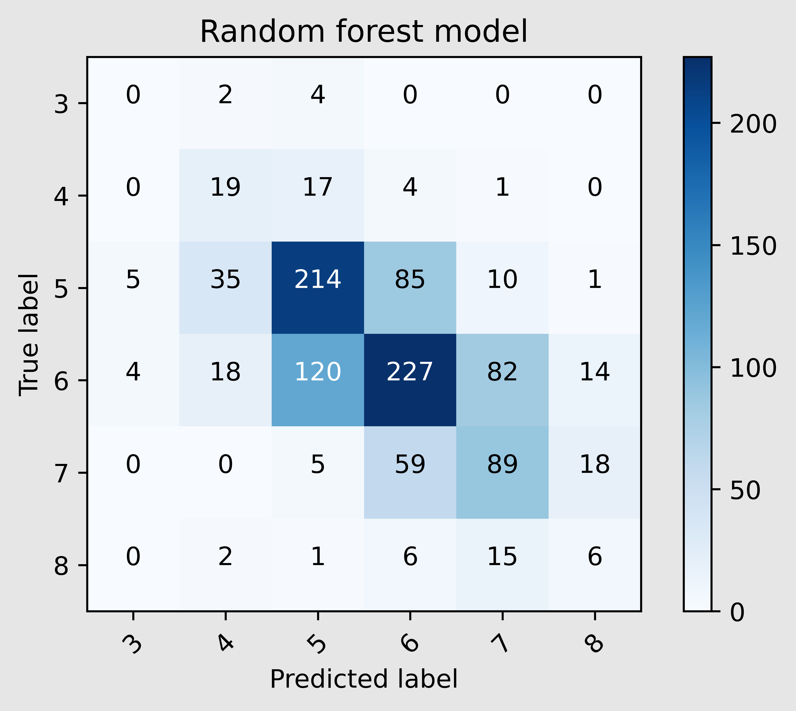

# Deep learning - Wine Quality challenge
## Description
This was an assignment we got during our time at Becode.  
The main goal was to gain more knowledge on how to work with neural networks.  
For this we used a [dataset on wine quality](https://archive.ics.uci.edu/ml/datasets/wine+quality).

## Installation
### Python version
* Python 3.9

### Packages used
* numpy==1.20.3
* pandas==1.3.2
* scikit-learn==0.24.2
* matplotlib==3.4.2
* tensorflow==2.6.0
* keras==2.6.0
* jupyter==1.0.0
* jupyterlab==3.1.10
* imbalanced-learn==0.8.0

## Usage

| File                             | Description                                                                 |
|----------------------------------|-----------------------------------------------------------------------------|
| assignment-files                 | Folder containing all the files we received to use on this project.         |
| models                           | Folder containing the best scoring models I came across                     |
| functions.py                     | Python file used to store all the functions I used throughout this project. |
| neural_network_categorical.ipynb | Jupyter notebook used for training a NN-model, on binary target.            |

## Step by step explanation of how I did it
#### 1. Categorised the quality, added this as an extra column: "target"  

| class | values                      |
|-------|-----------------------------|
| 0     | Quality below or equal to 5 |
| 1     | Quality above or equal to 6 |

####  2. Neural network on unbalanced dataset, 2 categories
| Metric     | Score on test_set |
|------------|-------------------|
| Accuracy   | 0.744             |
| Loss_score | 0.516             |

#### 3. Handling the unbalance in the data with a combination of under- and oversampling

#### 4. Neural network on a balanced dataset, 2 categories

+------------+-------------------+
| Metric     | Score on test_set |
+============+===================+
| Accuracy   | 0.776             |
+------------+-------------------+
| Loss_score | 0.490             |
+------------+-------------------+

#### 5. Random forest on a balanced dataset, 2 categories

| Metric   | Score |
|----------|-------|
| Accuracy | 0.79  |

#### 6. Predicting a score instead of a category
I decided to drop quality of "9", because there were just to few data points.

| quality value | number of data points |
|---------------|-----------------------|
| 3             | 30                    |
| 4             | 206                   |
| 5             | 1751                  |
| 6             | 2323                  |
| 7             | 855                   |
| 8             | 148                   |
| 9             | 5                     |

#### 7. Neural network on balanced dataset, using regression

+----------+-------+
| Metric   | Score |
+==========+=======+
| Accuracy | 0.46  |
+----------+-------+

#### 8. Random forest model

+----------+-------+
| Metric   | Score |
+==========+=======+
| Accuracy | 0.52  |
+----------+-------+

## Contributors

+---------------+----------------------------------+
| Name          | Github                           |
+===============+==================================+
| Matthew Samyn | https://github.com/matthew-samyn |
+---------------+----------------------------------+

## Timeline
07/09/2021 - 09/09/2021 